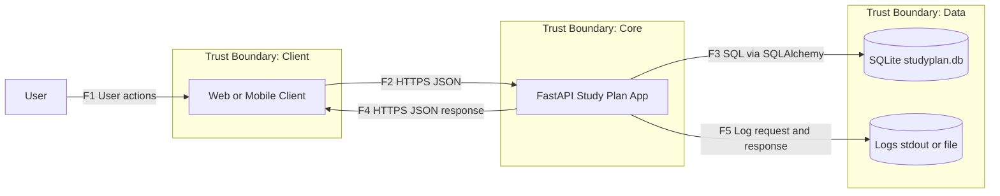
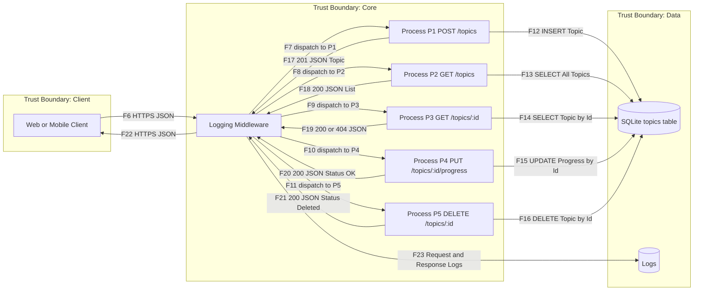

# DFD — Study Plan App (Exact to Code, GitHub‑safe)

This DFD matches the provided code: a single FastAPI app (`app.main`), logging middleware, SQLAlchemy to a local SQLite DB (`studyplan.db`). No API Gateway or extra services.

## Level 0 — Context

---

## Level 1 — Processes and Endpoints

Processes reflect your endpoints and middleware exactly:

- P1: POST /topics
- P2: GET /topics
- P3: GET /topics/:id
- P4: PUT /topics/:id/progress
- P5: DELETE /topics/:id
- MW: Logging Middleware (wraps all requests and responses)

---

## Flows Summary (F1…F23)

| ID  | From             | To                 | Data                              | Channel              |
|-----|------------------|--------------------|-----------------------------------|----------------------|
| F1  | User             | Client             | UI interactions                   | UI                   |
| F2  | Client           | FastAPI App        | HTTP request JSON                 | HTTPS                |
| F3  | FastAPI App      | SQLite             | SQL CRUD                          | Local driver         |
| F4  | FastAPI App      | Client             | HTTP response JSON                | HTTPS                |
| F5  | FastAPI App      | Logs               | Request and response log lines    | stdout or file       |
| F6  | Client           | Middleware         | HTTP request JSON                 | HTTPS                |
| F7  | Middleware       | P1                 | Dispatch                          | in process           |
| F8  | Middleware       | P2                 | Dispatch                          | in process           |
| F9  | Middleware       | P3                 | Dispatch                          | in process           |
| F10 | Middleware       | P4                 | Dispatch                          | in process           |
| F11 | Middleware       | P5                 | Dispatch                          | in process           |
| F12 | P1               | SQLite             | INSERT Topic                      | SQL                  |
| F13 | P2               | SQLite             | SELECT all                        | SQL                  |
| F14 | P3               | SQLite             | SELECT by id                      | SQL                  |
| F15 | P4               | SQLite             | UPDATE progress                   | SQL                  |
| F16 | P5               | SQLite             | DELETE by id                      | SQL                  |
| F17 | P1               | Middleware         | 201 JSON Topic                    | in process           |
| F18 | P2               | Middleware         | 200 JSON List                     | in process           |
| F19 | P3               | Middleware         | 200 or 404 JSON                   | in process           |
| F20 | P4               | Middleware         | 200 JSON Status OK                | in process           |
| F21 | P5               | Middleware         | 200 JSON Status Deleted           | in process           |
| F22 | Middleware       | Client             | HTTP response JSON                | HTTPS                |
| F23 | Middleware       | Logs               | Log lines                         | stdout or file       |

---

## Notes

- This mirrors the exact code: single app, middleware, SQLite. No gateway.
- Mermaid is GitHub-safe: ASCII only, blank line after `flowchart LR`, one edge per line, no braces in labels.
- You can extend later with CORS, auth, or migrations; then update the DFD accordingly.
